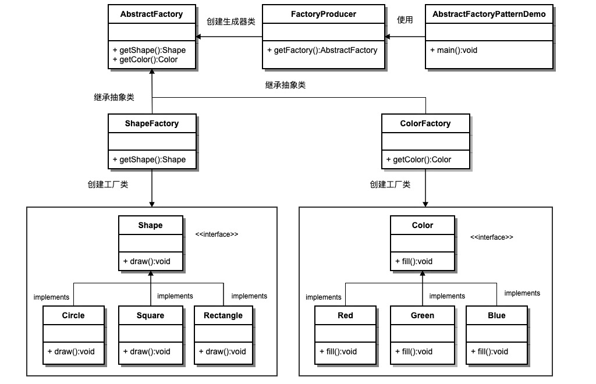

### 简单工厂
1. 声明一个包含公共方法的接口
2. 让被创建的类都实现这个接口
3. 声明一个工厂，传入不同的参数来获取具体的实现类，但是返回的类型是上面的接口

### 抽象工厂
一个根据不同的选择来先创建不同的简单工厂，再由简单工厂来创建具体的实现类

## 建造者模式
建造者模式（Builder Pattern）使用多个简单的对象一步一步构建成一个复杂的对象。这种类型的设计模式属于创建型模式，它提供了一种创建对象的最佳方式。

一个 Builder 类会一步一步构造最终的对象。该 Builder 类是独立于其他对象的。

#### 介绍
意图：将一个复杂的构建与其表示相分离，使得同样的构建过程可以创建不同的表示。

主要解决：主要解决在软件系统中，有时候面临着"一个复杂对象"的创建工作，其通常由各个部分的子对象用一定的算法构成；由于需求的变化，这个复杂对象的各个部分经常面临着剧烈的变化，但是将它们组合在一起的算法却相对稳定。

何时使用：一些基本部件不会变，而其组合经常变化的时候。

如何解决：将变与不变分离开。

关键代码：建造者：创建和提供实例，导演：管理建造出来的实例的依赖关系。

应用实例： 1、去肯德基，汉堡、可乐、薯条、炸鸡翅等是不变的，而其组合是经常变化的，生成出所谓的"套餐"。 2、JAVA 中的 StringBuilder。

优点： 1、建造者独立，易扩展。 2、便于控制细节风险。

缺点： 1、产品必须有共同点，范围有限制。 2、如内部变化复杂，会有很多的建造类。

使用场景： 1、需要生成的对象具有复杂的内部结构。 2、需要生成的对象内部属性本身相互依赖。

注意事项：与工厂模式的区别是：建造者模式更加关注与零件装配的顺序。
### 实现

我们假设一个快餐店的商业案例，其中，一个典型的套餐可以是一个汉堡（Burger）和一杯冷饮（Cold drink）。汉堡（Burger）可以是素食汉堡（Veg Burger）或鸡肉汉堡（Chicken Burger），它们是包在纸盒中。冷饮（Cold drink）可以是可口可乐（coke）或百事可乐（pepsi），它们是装在瓶子中。

我们将创建一个表示食物条目（比如汉堡和冷饮）的 Item 接口和实现 Item 接口的实体类，以及一个表示食物包装的 Packing 接口和实现 Packing 接口的实体类，汉堡是包在纸盒中，冷饮是装在瓶子中。

然后我们创建一个 Meal 类，带有 Item 的 ArrayList 和一个通过结合 Item 来创建不同类型的 Meal 对象的 MealBuilder。BuilderPatternDemo 类使用 MealBuilder 来创建一个 Meal。

## 原型模式(Prototype pattern)
原型模式（Prototype Pattern）是用于创建重复的对象，同时又能保证性能。这种类型的设计模式属于创建型模式，它提供了一种创建对象的最佳方式。

这种模式是实现了一个原型接口(或者是抽象类)，该接口用于创建当前对象的克隆。当直接创建对象的代价比较大时，则采用这种模式。例如，一个对象需要在一个高代价的数据库操作之后被创建。我们可以缓存该对象，在下一个请求时返回它的克隆，在需要的时候更新数据库，以此来减少数据库调用。

## 适配器模式(Adapter pattern)
适配器模式（Adapter Pattern）是作为两个不兼容的接口之间的桥梁。这种类型的设计模式属于结构型模式，它结合了两个独立接口的功能。

这种模式涉及到一个单一的类，该类负责加入独立的或不兼容的接口功能。举个真实的例子，读卡器是作为内存卡和笔记本之间的适配器。您将内存卡插入读卡器，再将读卡器插入笔记本，这样就可以通过笔记本来读取内存卡。

我们通过下面的实例来演示适配器模式的使用。其中，音频播放器设备只能播放 mp3 文件，通过使用一个更高级的音频播放器来播放 vlc 和 mp4 文件。
### 实现
我们有一个 MediaPlayer 接口和一个实现了 MediaPlayer 接口的实体类 AudioPlayer。默认情况下，AudioPlayer 可以播放 mp3 格式的音频文件。

我们还有另一个接口 AdvancedMediaPlayer 和实现了 AdvancedMediaPlayer 接口的实体类。该类可以播放 vlc 和 mp4 格式的文件。

我们想要让 AudioPlayer 播放其他格式的音频文件。为了实现这个功能，我们需要创建一个实现了 MediaPlayer 接口的适配器类 MediaAdapter，并使用 AdvancedMediaPlayer 对象来播放所需的格式。

AudioPlayer 使用适配器类 MediaAdapter 传递所需的音频类型，不需要知道能播放所需格式音频的实际类。AdapterPatternDemo 类使用 AudioPlayer 类来播放各种格式。

## 桥接模式 (Bridge pattern)
桥接（Bridge）是用于把抽象化与实现化解耦，使得二者可以独立变化。这种类型的设计模式属于结构型模式，它通过提供抽象化和实现化之间的桥接结构，来实现二者的解耦。

这种模式涉及到一个作为桥接的接口，使得实体类的功能独立于接口实现类。这两种类型的类可被结构化改变而互不影响。

我们通过下面的实例来演示桥接模式（Bridge Pattern）的用法。其中，可以使用相同的抽象类方法但是不同的桥接实现类，来画出不同颜色的圆。

### 实现
我们有一个作为桥接实现的 DrawAPI 接口和实现了 DrawAPI 接口的实体类 RedCircle、GreenCircle。Shape 是一个抽象类，将使用 DrawAPI 的对象。BridgePatternDemo 类使用 Shape 类来画出不同颜色的圆。
