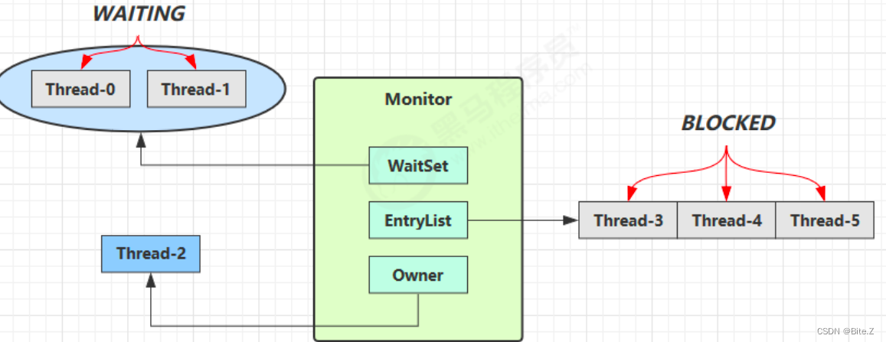
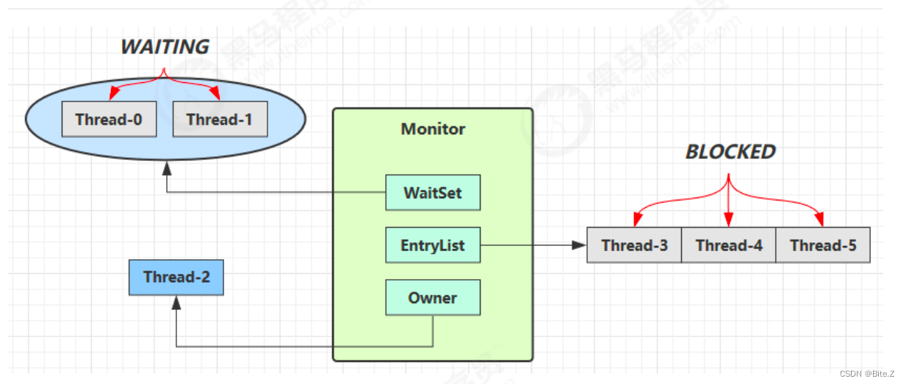

## CountDownLatch 
```aidl
当一个或多个线程调用await方法时，这些线程会阻塞。其它线程调用countDown方法会将计数器减1，当计数器的值变为0时，因await方法阻塞的线程会被唤醒，继续执行。
实现原理：计数器的值由构造函数传入，并用它初始化AQS的state值。当线程调用await方法时会检查state的值是否为0，如果是就直接返回（即不会阻塞）；如果不是，将表示该节点的线程入列，然后将自身阻塞。当其它线程调用countDown方法会将计数器减1，
然后判断计数器的值是否为0，当它为0时，会唤醒队列中的第一个节点，由于CountDownLatch使用了AQS的共享模式，所以第一个节点被唤醒后又会唤醒第二个节点，以此类推，使得所有因await方法阻塞的线程都能被唤醒而继续执行。
```
---
## CyclicBarrier
```aidl
CyclicBarrier和CountDownLatch都可以实现线程的等待，其区别主要有两点：
(01) CountDownLatch的作用是允许1或N个线程等待其他线程完成执行；而CyclicBarrier则是允许N个线程相互等待。
(02) CountDownLatch的计数器无法被重置；CyclicBarrier的计数器可以被重置后使用，因此它被称为是循环的barrier。

CyclicBarrierd的函数列表：
CyclicBarrier(int parties)
创建一个新的 CyclicBarrier，它将在给定数量的参与者（线程）处于等待状态时启动，但它不会在启动 barrier 时执行预定义的操作。
CyclicBarrier(int parties, Runnable barrierAction)
创建一个新的 CyclicBarrier，它将在给定数量的参与者（线程）处于等待状态时启动，并在启动 barrier 时执行给定的屏障操作，该操作由最后一个进入 barrier 的线程执行。
int await()
在所有参与者都已经在此 barrier 上调用 await 方法之前，将一直等待。
int await(long timeout, TimeUnit unit)
在所有参与者都已经在此屏障上调用 await 方法之前将一直等待,或者超出了指定的等待时间。
int getNumberWaiting()
返回当前在屏障处等待的参与者数目。
int getParties()
返回要求启动此 barrier 的参与者数目。
boolean isBroken()
查询此屏障是否处于损坏状态。
void reset()
将屏障重置为其初始状态。

```
## Synchronized原理
Synchronized的原理是在底层使用了monitorenter进行加锁，monitorexit进行解锁，其中monitor的底层实现是通过C语言来实现的。在这里不介绍具体的Monitor的底层，只分析Synchronized的一个实现原理，其实JAVA中的ReentrantLock和Monitor是很类似的。

Monitor被翻译为监视器或管程，每个 Java 对象都可以关联一个 Monitor 对象，如果使用 synchronized 给对象上锁（重量级）之后，该对象头的 Mark Word 中就被设置指向 Monitor 对象的指针 Monitor 结构如下：

- 刚开始 Monitor 中 Owner 为 null
- 当 Thread-2 执行 synchronized(obj) 就会将 Monitor 的所有者 Owner 置为 Thread-2，Monitor中只能有一 个 Owner
- 在 Thread-2 上锁的过程中，如果 Thread-3，Thread-4，Thread-5 也来执行 synchronized(obj)，就会进入 EntryList BLOCKED
- Thread-2 执行完同步代码块的内容，然后唤醒 EntryList 中等待的线程来竞争锁，竞争的时是非公平的
- 图中 WaitSet 中的 Thread-0，Thread-1 是之前获得过锁，但条件不满足(wait()方法)进入 WAITING 状态的线程

注意：
- synchronized 必须是进入同一个对象的 monitor 才有上述的效果
- 不加 synchronized 的对象不会关联监视器，不遵从以上规则

## Wait/Notify原理

- Owner 线程发现条件不满足，调用 wait 方法，即可进入 WaitSet 变为 WAITING 状态
- BLOCKED 和 WAITING 的线程都处于阻塞状态，不占用 CPU 时间片
- BLOCKED 线程会在 Owner 线程释放锁时唤醒
- WAITING 线程会在 Owner 线程调用 notify 或 notifyAll 时唤醒，但唤醒后并不意味者立刻获得锁，仍需进入 EntryList 重新竞争